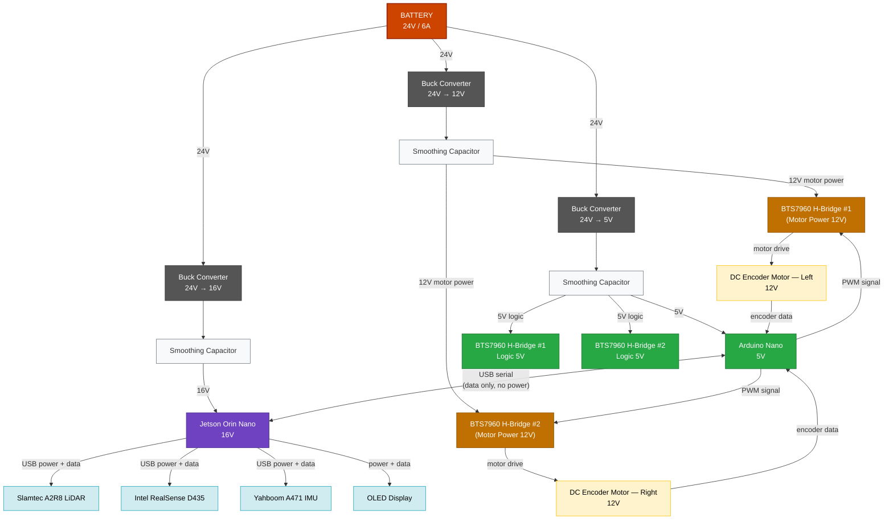

# Bluebot Power Distribution

## Overview

The robot is powered by a single **24V / 6A battery**. Power is distributed through three independent buck converter rails, each with a smoothing capacitor to mitigate voltage drop under load. All component power requirements are isolated per rail — motor current draw does not affect logic or compute power.

## Power Distribution Diagram

## Rail Summary

| Rail | Voltage | Buck Converter | Consumers |
|---|---|---|---|
| Compute | 16V | 24V → 16V | Jetson Orin Nano (+ downstream USB peripherals) |
| Drive | 12V | 24V → 12V | BTS7960 H-Bridge motor power (×2) → DC motors (×2) |
| Logic | 5V | 24V → 5V | Arduino Nano, BTS7960 H-Bridge logic power (×2) |

## Notes

- All three rails include smoothing capacitors to absorb transient current draw, particularly from motor start/stop events on the 12V rail.
- The Arduino Nano is powered exclusively from the 5V rail. Its USB connection to the Jetson carries serial data only — no bus power is drawn from the Jetson.
- The Arduino sends PWM signals to each BTS7960 H-Bridge to control motor speed and direction. Encoder feedback from both drive motors is wired directly back to the Arduino for odometry.
- Motor power (12V) and H-Bridge logic power (5V) are on separate rails so motor switching transients cannot affect Arduino or Jetson stability.
- The LiDAR, RealSense D435, and IMU are all connected to the Jetson via USB, which provides both power and data. The Jetson's onboard regulators supply USB bus power from its 16V input.
