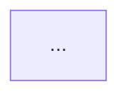

# Bluebot Stack Diagrams

Mermaid source diagrams for the current `robot_bringup` stack.

## Diagram Files

- `master_stack_diagram.mmd`
  - High-level view of `bluebot_bringup.sh` mapping + navigation modes.
- `start_map_stack.mmd`
  - Detailed flow for `bluebot_bringup.sh start mapping`.
- `start_nav_stack.mmd`
  - Detailed flow for `bluebot_bringup.sh start navigation <map>`.

## Render in Markdown

Use Mermaid fenced blocks in Markdown-enabled renderers (GitHub/GitLab/VS Code plugins):

````md

````

## Render with Mermaid CLI

```bash
export ROS_WS=/path/to/your/ros2_ws
npm install -g @mermaid-js/mermaid-cli

mmdc -i "$ROS_WS/docs/stack_diagrams/master_stack_diagram.mmd" -o "$ROS_WS/docs/stack_diagrams/master_stack_diagram.svg"
mmdc -i "$ROS_WS/docs/stack_diagrams/start_map_stack.mmd" -o "$ROS_WS/docs/stack_diagrams/start_map_stack.svg"
mmdc -i "$ROS_WS/docs/stack_diagrams/start_nav_stack.mmd" -o "$ROS_WS/docs/stack_diagrams/start_nav_stack.svg"
```

## Quick Local Check

```bash
export ROS_WS=/path/to/your/ros2_ws
cd "$ROS_WS/docs/stack_diagrams"
python3 - <<'PY'
from pathlib import Path

for name in [
    "master_stack_diagram.mmd",
    "start_map_stack.mmd",
    "start_nav_stack.mmd",
]:
    print(f"\n--- {name} ---")
    print(Path(name).read_text())
PY
```
