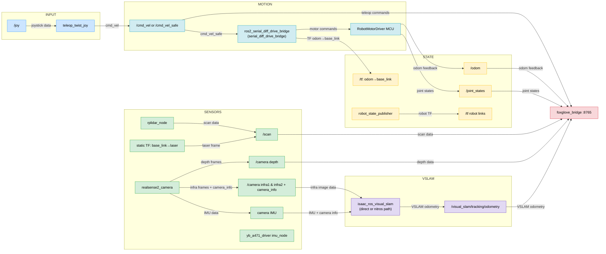
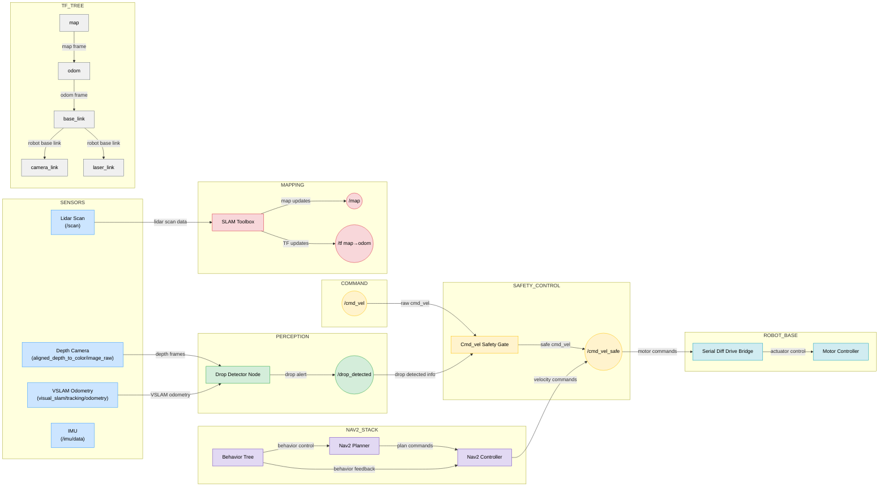
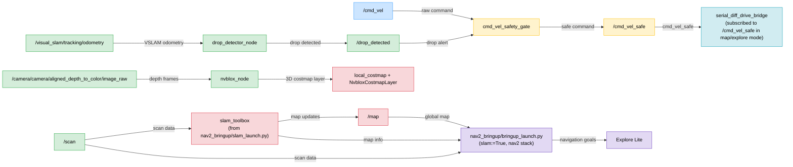
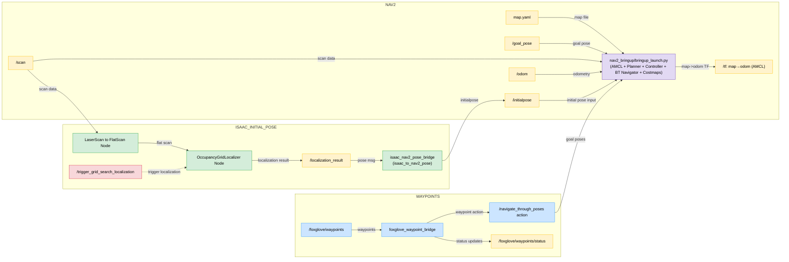
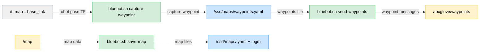

# Bluebot ROS2 Stack Flow

This diagram is derived from:
- `/ssd/ros2_ws/scripts/bluebot.sh`
- `/ssd/ros2_ws/src/*` launch/config/node files used by `bluebot.sh`

## 1) Mode Matrix

| Mode | Base Stack | Mapping Job | Nav2 Bringup | Isaac Grid Localizer + Bridge |
|---|---|---|---|---|
| `start` | Yes | No | No | No |
| `start-map` | Yes | Yes | (via `nav2_bringup/slam_launch.py`) | No |
| `start-map-explore` | Yes | Yes | Yes (`bringup_launch.py`, `slam:=True`) | No |
| `start-nav <map>` | Yes | No | Yes (`bringup_launch.py`) | Yes |
| `start` + `NVBLOX_ENABLED=true` | Yes | No | No | No |
| `start-map` + `EXPLORE_LITE_ENABLED=true` | Yes | Yes | (via `nav2_bringup/slam_launch.py`) | No |
| `start-nav <map>` + `EXPLORE_LITE_ENABLED=true` | Yes | No | Yes (`bringup_launch.py`) | Yes |

## 2) Base Stack (all modes)

## 3) Mapping Overlay (`start-map`)

## 4) Mapping + Exploration (`start-map-explore`)

## 5) Navigation Overlay (`start-nav <map>`)

## 6) Utility Flows

## 6) Frame Ownership Summary

- `odom -> base_link`: `ros2_serial_diff_drive_bridge` (from wheel telemetry)
- `map -> odom` in mapping: `slam_toolbox`
- `map -> odom` in navigation: `AMCL` (Nav2)
- `base_link -> laser`: `lidar_with_tf.launch.py` static TF
- `base_link -> camera_link`: `bluebot.sh` static TF
- `isaac_ros_visual_slam` is configured with `publish_odom_to_base_tf=false` and `publish_map_to_odom_tf=false` to avoid TF conflicts.
