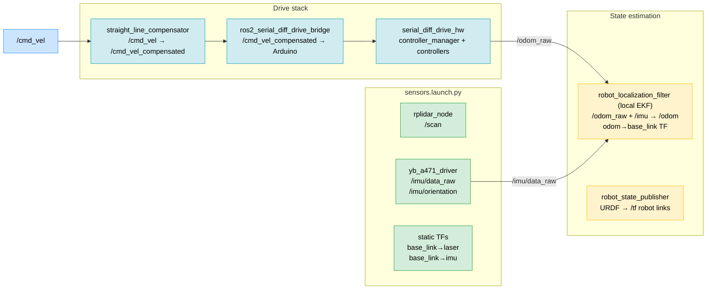
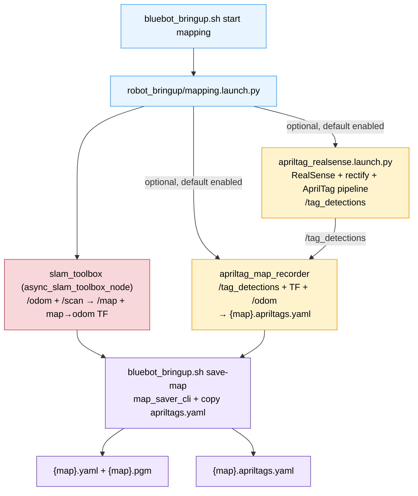
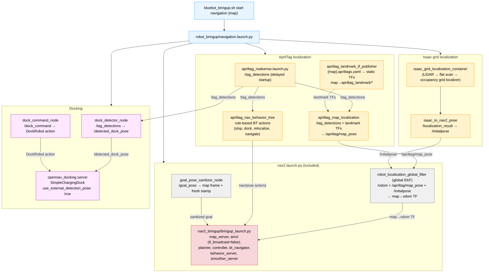
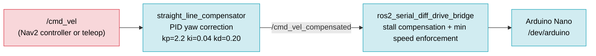

# Bluebot ROS2 Stack Flow

Derived from `scripts/bluebot_bringup.sh` and the launch/config/node files in `src/robot_bringup/`.
Detailed `.mmd` source diagrams are in `docs/stack_diagrams/`.

---

## 1) Mode Matrix

| Mode | Drivetrain | Sensors | Local EKF | Straight-Line Comp | SLAM | Nav2 | AprilTag Camera | Global EKF | Isaac Grid Loc | Docking |
|---|:---:|:---:|:---:|:---:|:---:|:---:|:---:|:---:|:---:|:---:|
| `sensors` | | ✓ | | | | | | | | |
| `apriltag` | | ✓ | | | | | ✓ | | | |
| `mapping` | ✓ | ✓ | ✓ | ✓ | ✓ | | optional | | | |
| `nav2 <map>` | ✓ | | ✓ | ✓ | | ✓ | | | | |
| `navigation <map>` | ✓ | ✓ | ✓ | ✓ | | ✓ | ✓ | ✓ | ✓ | ✓ |
| `localization` | | ✓ | | | | | ✓ | | ✓ | |
| `health` | (monitor only) | | | | | | | | | |
| `observability` | (metrics only) | | | | | | | | | |

Primary entry: `scripts/bluebot_bringup.sh start <mode>`
Navigation convenience wrapper: `scripts/bluebot_nav.sh start [map]`

---

## 2) Shared Base Stack (`mapping` + `navigation`)

```mermaid
flowchart LR
classDef input fill:#cce5ff,stroke:#3399ff,stroke-width:1px,color:#000;
classDef motion fill:#d1ecf1,stroke:#17a2b8,stroke-width:1px,color:#000;
classDef state fill:#fff3cd,stroke:#ffc107,stroke-width:1px,color:#000;
classDef sensors fill:#d4edda,stroke:#28a745,stroke-width:1px,color:#000;

subgraph SENSORS["sensors.launch.py"]
  Lidar["rplidar_node\n/scan"]:::sensors
  IMU["yb_a471_driver\n/imu/data_raw\n/imu/orientation"]:::sensors
  TFsensor["static TFs\nbase_link→laser\nbase_link→imu"]:::sensors
end

subgraph DRIVE["Drive stack"]
  Comp["straight_line_compensator\n/cmd_vel → /cmd_vel_compensated"]:::motion
  Bridge["ros2_serial_diff_drive_bridge\n/cmd_vel_compensated → Arduino"]:::motion
  HW["serial_diff_drive_hw\ncontroller_manager + controllers"]:::motion
end

subgraph STATE["State estimation"]
  LocalEKF["robot_localization_filter (local EKF)\n/odom_raw + /imu → /odom\nodom→base_link TF"]:::state
  RSP["robot_state_publisher\nURDF → /tf robot links"]:::state
end

CmdIn["/cmd_vel"]:::input
Comp --> Bridge --> HW
HW -->|/odom_raw| LocalEKF
IMU -->|/imu/data_raw| LocalEKF
CmdIn --> Comp
```

---

## 3) Mapping Mode (`mapping`)

```mermaid
flowchart TD
classDef launch fill:#e8f4ff,stroke:#3399ff,stroke-width:1px,color:#000;
classDef mapping fill:#f8d7da,stroke:#dc3545,stroke-width:1px,color:#000;
classDef apriltag fill:#fff3cd,stroke:#ff9800,stroke-width:1px,color:#000;
classDef state fill:#f0f0f0,stroke:#6c757d,stroke-width:1px,color:#000;
classDef ops fill:#efe8ff,stroke:#6f42c1,stroke-width:1px,color:#000;

A["bluebot_bringup.sh start mapping"]:::launch
B["robot_bringup/mapping.launch.py"]:::launch

SLAM["slam_toolbox (async_slam_toolbox_node)\n/odom + /scan → /map + map→odom TF"]:::mapping

AT0["apriltag_realsense.launch.py\nRealSense + rectify + AprilTag pipeline\n/tag_detections"]:::apriltag
AT1["apriltag_map_recorder\n/tag_detections + TF + /odom\n→ {map}.apriltags.yaml"]:::apriltag

SAVE["bluebot_bringup.sh save-map\nmap_saver_cli + copy apriltags.yaml"]:::ops
ART1["{map}.yaml + {map}.pgm"]:::ops
ART2["{map}.apriltags.yaml"]:::ops

A --> B
B --> SLAM
B -->|optional, default enabled| AT0
B -->|optional, default enabled| AT1

AT0 -->|/tag_detections| AT1
SLAM --> SAVE --> ART1
AT1 --> SAVE --> ART2
```

---

## 4) Navigation Mode (`navigation <map>`)

```mermaid
flowchart TD
classDef launch fill:#e8f4ff,stroke:#3399ff,stroke-width:1px,color:#000;
classDef nav2 fill:#f8d7da,stroke:#dc3545,stroke-width:1px,color:#000;
classDef state fill:#f0f0f0,stroke:#6c757d,stroke-width:1px,color:#000;
classDef apriltag fill:#fff3cd,stroke:#ff9800,stroke-width:1px,color:#000;
classDef docking fill:#fde8ff,stroke:#9c27b0,stroke-width:1px,color:#000;
classDef ops fill:#efe8ff,stroke:#6f42c1,stroke-width:1px,color:#000;

A["bluebot_bringup.sh start navigation {map}"]:::launch
B["robot_bringup/navigation.launch.py"]:::launch

subgraph NAV2["nav2.launch.py (included)"]
  N1["nav2_bringup/bringup_launch.py\nmap_server, amcl (tf_broadcast=false),\nplanner, controller, bt_navigator,\nbehavior_server, smoother_server"]:::nav2
  N2["robot_localization_global_filter (global EKF)\n/odom + /apriltag/map_pose + /initialpose\n→ map→odom TF"]:::state
  N3["goal_pose_sanitizer_node\n/goal_pose → map frame + fresh stamp"]:::state
end

subgraph APRILTAG["AprilTag localization"]
  AT0["apriltag_realsense.launch.py\n/tag_detections (delayed startup)"]:::apriltag
  AT1["apriltag_landmark_tf_publisher\n{map}.apriltags.yaml → static TFs\nmap→apriltag_landmark/*"]:::apriltag
  AT2["apriltag_map_localization\n/tag_detections + landmark TFs\n→ /apriltag/map_pose"]:::apriltag
  AT3["apriltag_nav_behavior_tree\nrule-based BT actions\n(stop, dock, relocalize, navigate)"]:::apriltag
end

subgraph GRIDLOC["Isaac grid localization"]
  GL1["isaac_grid_localization_container\n(LiDAR → flat scan → occupancy grid localizer)"]:::apriltag
  GL2["isaac_to_nav2_pose\n/localization_result → /initialpose"]:::apriltag
end

subgraph DOCKING["Docking"]
  DK1["dock_detector_node\n/tag_detections → /detected_dock_pose"]:::docking
  DK2["dock_command_node\n/dock_command → DockRobot action"]:::docking
  DK3["opennav_docking server\nSimpleChargingDock\nuse_external_detection_pose: true"]:::docking
end

A --> B
B --> NAV2
B --> APRILTAG
B --> GRIDLOC
B --> DOCKING

AT0 -->|/tag_detections| AT2
AT0 -->|/tag_detections| DK1
AT0 -->|/tag_detections| AT3
AT1 -->|landmark TFs| AT2
AT2 -->|/apriltag/map_pose| N2
GL1 --> GL2 -->|/initialpose| N2
N2 -->|map→odom TF| N1
AT3 -->|nav/pose actions| N1
N3 -->|sanitized goal| N1
DK1 -->|/detected_dock_pose| DK3
DK2 -->|DockRobot action| DK3
```

---

## 5) cmd_vel Pipeline (all drive modes)

```mermaid
flowchart LR
classDef nav2 fill:#f8d7da,stroke:#dc3545,stroke-width:1px,color:#000;
classDef motion fill:#d1ecf1,stroke:#17a2b8,stroke-width:1px,color:#000;

Nav2["/cmd_vel\n(Nav2 controller or teleop)"]:::nav2
Comp["straight_line_compensator\nPID yaw correction\nkp=2.2 ki=0.04 kd=0.20"]:::motion
Bridge["ros2_serial_diff_drive_bridge\nstall compensation + min speed enforcement"]:::motion
Arduino["Arduino Nano\n/dev/arduino"]:::motion

Nav2 --> Comp -->|/cmd_vel_compensated| Bridge --> Arduino
```

---

## 6) Frame Ownership Summary

| TF Link | Owner | Mode |
|---|---|---|
| `odom → base_link` | `ros2_serial_diff_drive_bridge` (wheel odometry) | all drive modes |
| `map → odom` | `slam_toolbox` | mapping |
| `map → odom` | `robot_localization_global_filter` (global EKF) | navigation |
| `base_link → laser` | static TF publisher (`sensors.launch.py`) | all |
| `base_link → camera_link` | static TF publisher (`apriltag_realsense.launch.py`) | apriltag, navigation |
| `map → apriltag_landmark/*` | `apriltag_landmark_tf_publisher` | navigation |

**Notes:**
- AMCL runs in navigation mode with `tf_broadcast: false` — the global EKF owns `map→odom`, not AMCL.
- Isaac ROS Visual SLAM is configured with `publish_odom_to_base_tf=false` and `publish_map_to_odom_tf=false` to avoid TF conflicts if enabled.
